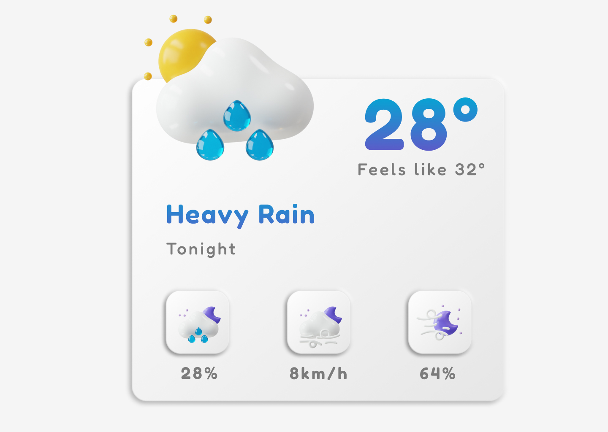

# Weaer UI

## Table of contents

- 
  - [Table of contents](#table-of-contents)
  - [Overview](#overview)
    - [Screenshot](#screenshot)
    - [Links](#links)
  - [My process](#my-process)
    - [Built with](#built-with)
  - [Author](#author)

### Screenshot

### Links

- Live Site URL: [Add live site URL here](https://ifdotcom.github.io/weather-card/)

## My process

### Built with

- Semantic HTML5 markup
- CSS custom properties
- Flexbox
- Grid
- Position
- Media Queries

## Author

- GitHub - [ifdotcom](https://github.com/ifdotcom)
- Behance - [ifdotcom](https://www.behance.net/ifvidal)
- LinkedIn - [ifdotcom](https://www.linkedin.com/in/if-vidal/)
